# 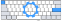 kicad-kbplacer

[](https://gitlab.com/kicad/addons/metadata/-/tree/main/packages/com.github.adamws.kicad-kbplacer)

[](https://circleci.com/gh/adamws/kicad-kbplacer/tree/master)
[](https://pypi.org/project/kbplacer/)
[](https://coveralls.io/github/adamws/kicad-kbplacer?branch=master)
[](https://hosted.weblate.org/engage/kicad-kbplacer/)

KiCad plugin for mechanical keyboard design. It features automatic key placement and routing
based on popular layout descriptions from [keyboard-layout-editor](http://www.keyboard-layout-editor.com/)
and [ergogen](https://github.com/ergogen/ergogen).

**Table of Contents**
- [Motivation](#motivation)
- [Features](#features)
- [Installation](#installation)
  - [As KiCad plugin](#installation-as-kicad-plugin)
  - [As python package](#installation-as-python-package)
- [Use from KiCad](#how-to-use-from-kicad)
  - [Options overview](#options-overview)
  - [Diode placement and routing](#diode-placement-and-routing)
    - [Diode automatic orientation adjustment](#diode-automatic-orientation-adjustment)
  - [Track templating](#track-templating)
  - [Additional elements placement](#additional-elements-placement)
  - [Building board outline](#building-board-outline)
  - [Run without layout](#run-without-layout)
- [Use from CLI or from another tools](#how-to-use-from-cli-or-another-tools)
  - [Run as a script](#run-as-a-script)
  - [Use in python projects](#use-in-python-projects)
- [Demo keyboard project](#demo-keyboard-project)
- [Troubleshooting](#troubleshooting)
  - [Plugin does not load](#plugin-does-not-load)
  - [Plugin misbehaves or crashes](#plugin-misbehaves-or-crashes)

<!-- TOC --><a name="motivation"></a>
## Motivation

All PCB's for mechanical keyboards shares common properties which creates great
opportunity for scripting. Although this project does not aim to provide
complete automatic PCB generation tool it speeds up development process
by reducing tedious element placement and routing tasks.

<!-- TOC --><a name="features"></a>
## Features

- Automatic keys and diodes placement
- Track routing and track template replication
- Support for KLE, [VIA](https://www.caniusevia.com/docs/layouts), [QMK](https://docs.qmk.fm/reference_info_json#layouts) and [ergogen](https://github.com/ergogen/ergogen) inputs
- User selectable diode position in relation to key position
- Configurable additional elements placement
- Board outline generation

> [!WARNING]
> Ergogen support is new experimental feature and it has not been tested extensively


Some examples can be found in [examples](./examples) directory.

**See also:**

:link: [Keyboard PCB design with ergogen and kbplacer](https://adamws.github.io/keyboard-pcb-design-with-ergogen-and-kbplacer/)

<!-- TOC --><a name="installation"></a>
## Installation

<!-- TOC --><a name="installation-as-kicad-plugin"></a>
### As KiCad plugin

To install release version of this plugin, use KiCad's `Plugin and Content Manager`
and select `Keyboard footprints placer` from official plugin repository.


To install development version, see how to use [custom plugin repository](./docs/custom_repository.md).
Custom repository is automatically updated with latest `master` branch builds
and it is available [here](https://adamws.github.io/kicad-kbplacer).

For development activities, it is recommended to checkout this repository and copy (or link)
content of `kbplacer` directory to one of the KiCad's plugin search paths.
For more details see [this](https://dev-docs.kicad.org/en/apis-and-binding/pcbnew/) guide.

After installation, plugin can be started by clicking plugin icon on the toolbar:


or selecting it from `Tools -> External Plugins` menu.
For more details about plugin usage see [Use from KiCad](#how-to-use-from-kicad) section.

<!-- TOC --><a name="installation-as-kicad-package"></a>
### As python package

The `kbplacer` can be installed with pip:

```shell
pip install kbplacer
```

When installed this way, it **can't** be launched from KiCad as KiCad plugin.
This option exist for usage via command line interface or for integrating with
another tools.

Command line interface provides more options but generally it is recommended for
more advanced users. For example it allows to create PCBs without schematic,
which is non-typical KiCad workflow.
For details see [Use from CLI or from another tools](#how-to-use-from-cli-or-another-tools) section.

> [!IMPORTANT]
> Most of the `kbplacer` python package functionalities depends on `pcbnew` package
> which is distributed as part of KiCad installation.
> This means, that on Windows it is **required** to use python bundled with KiCad.
> On Linux, `pcbnew` package should be available globally (this can be verified by
> running `python -c "import pcbnew; print(pcbnew.Version())"`) so it may not work
> inside isolated environment. To install inside virtual environment created with `venv`
> it is required to use `--system-site-package` option when creating this environment.

> [!NOTE]
> Both installation methods can be used simultaneously. When installed as KiCad plugin,
> some scripting capabilities are still available, but in order to use `kbplacer`
> in another python scripts, installing as python package is required.

<!-- TOC --><a name="how-to-use-from-kicad"></a>
## Use from KiCad

This is _traditional_ way of using this tool. Before it can be used on `kicad_pcb` project
file, user needs to create it and populate with footprints. In typical KiCad workflow
this is started by creating schematic. When PCB file is ready, user can start `kbplacer`
plugin in GUI mode from KiCad and run it with selected options.
To use this tool in this way, it needs to be installed following [plugin installation guide](#as-kicad-plugin).

- Create switch matrix schematic which meets following requirements:
  - Each switch has connected diode
    - Diodes can be connected in either direction. Track router attempts to connect
      closest (to each other) pads of switch and diode as long as both have same `netname`,
      i.e. are connected on the schematic
    - Each switch can have multiple diodes
  - Symbols are ordered by Y position.
      - :warning: This annotation scheme might not work well for certain 'ergo' layouts.
      - Annotation order is ignored when using layout with mapping to matrix defined
        (see [VIA](https://www.caniusevia.com/docs/layouts#switch-matrix-co-ordinates)
        specification).

    To learn more see [annotation guide](./docs/annotation_guide.md).

  

- Create new PCB and load netlist
- Obtain json layout file from [keyboard-layout-editor](http://www.keyboard-layout-editor.com/) or
  convert [ergogen](https://github.com/ergogen/ergogen) points file to json

  <details>
  <summary>keyboard-layout-editor details <i>(click to expand)</i></summary>

    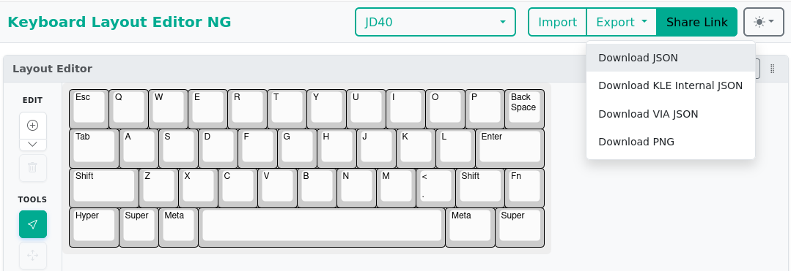

    Plugin supports internal [kle-serial](https://github.com/ijprest/kle-serial) layout files
    and [via](https://www.caniusevia.com/docs/layouts) files.
    Detection of layout format will be done automatically.
    Conversion between layout downloaded from keyboard-layout-editor and its internal form
    can be done with [https://adamws.github.io/kle-serial](https://adamws.github.io/kle-serial/)
    or [keyboard-tools.xyz/kle-converter](http://keyboard-tools.xyz/kle-converter)

    > [!NOTE]
    > When using `via` layouts, switch matrix **must** be annotated according to `via` rules.
    > If layout supports [multiple layout of keys](https://www.caniusevia.com/docs/layouts#layout-options)
    > only the default one will be used by `kicad-kbplacer`.

  </details>

  <details>
  <summary>ergogen details <i>(click to expand)</i></summary>

    - open your design in https://ergogen.cache.works/ and download `points.yaml`

      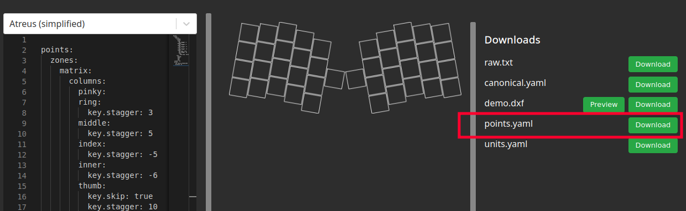

    - convert `yaml` to `json` (this operation is not integrated with `kicad-kbplacer` source
      because it would require installation of third-party `pyyaml` package and there is no
      good way to manage plugin dependencies yet)
      - you can use online converter, for example https://jsonformatter.org/yaml-to-json
    - converted file should be automatically recognized in next steps

  </details>

- Run `kicad-kbplacer` plugin
- Select json layout file and plugin options and click OK.

  

It is possible to run this plugin from command line. Everything which can be done via GUI can
be also achieved using command line.
Execute following command (in the directory where plugin is installed) to get more details:

```
python -m com_github_adamws_kicad-kbplacer --help
```

> [!IMPORTANT]
> On windows, use python bundled with KiCad

<!-- TOC --><a name="options-overview"></a>
### Options overview

<table>
  <tr>
    <th align="center"><b>Section</b></th>
    <th align="center"><b>Label</b></th>
    <th align="center"><b>Description</b></th>
  </tr>
  <tr>
    <td rowspan="5" align="center" style="vertical-align: middle;">Switch settings</td>
    <td align="center" style="vertical-align: middle;">Keyboard layout file</td>
    <td>
      Layout file path. Supports <a href="http://www.keyboard-layout-editor.com/">keyboard-layout-editor</a>
      json layouts in both raw and internal form, <a href="https://www.caniusevia.com/docs/layouts">via</a>
      and <a href="https://docs.qmk.fm/reference_info_json#layouts">qmk</a> json layouts and <a href="https://docs.ergogen.xyz/formats">ergogen</a>
      canonical yaml points files converted to json.</br>
      Can be empty to run without switch footprints placement.
    </td>
  </tr>
  <tr>
    <td align="center" style="vertical-align: middle;">Step X / Step Y</td>
    <td>
      Distance (in millimeters) of 1U between two switches in X and Y directions.
    </td>
  </tr>
  <tr>
    <td align="center" style="vertical-align: middle;">Footprint Annotation</td>
    <td>
      The switch footprint annotation format with single replacement field <code>{}</code>
      which will get replaced with incremented footprint number.
      This string is internally used by python's <code>str.format</code> function.
    </td>
  </tr>
  <tr>
    <td align="center" style="vertical-align: middle;">Orientation</td>
    <td>
      Angle (in degrees) of switch footprints.
    </td>
  </tr>
  <tr>
    <td align="center" style="vertical-align: middle;">Side</td>
    <td>
      Selects <code>Front</code> or <code>Back</code> side of the board.
    </td>
  </tr>
  <tr>
    <td rowspan="9" align="center" style="vertical-align: middle;">Switch diodes settings</td>
    <td align="center" style="vertical-align: middle;">Allow autoplacement</td>
    <td>
      Enables automatic diodes positioning. When turned on, each diode will be placed
      next to the switch footprint with common net, according to the position
      settings. When disabled, diodes will not be moved.</br>
      If any switch has more than one diode, then <code>Default</code> and <code>Custom</code>
      position options are not supported.
    </td>
  </tr>
  <tr>
    <td align="center" style="vertical-align: middle;">Route with switches</td>
    <td>
      Enables automatic routing of switch-diode pairs. If user manually route first pair,
      then it replicates the connection for remaining pairs. If not, uses automatic
      internal router. When automatic router used, attempts to connect only two closest
      pads of the same net. Automatic router will use default track width of a routed netclass.
    </td>
  </tr>
  <tr>
    <td align="center" style="vertical-align: middle;">Automatically adjust orientation</td>
    <td>
      Enables automatic diode orientation adjustment based on distance between diode
      and corresponding switch. Useful for some key matrix types, for example Japanese
      duplex matrix, where diodes are connected with alternating directions.
    </td>
  </tr>
  <tr>
    <td align="center" style="vertical-align: middle;">Footprint annotation</td>
    <td>
      The diode annotation format. Same rules as for switch footprint annotation applies.
    </td>
  </tr>
  <tr>
    <td align="center" style="vertical-align: middle;">Position</td>
    <td>
      Diode position option with three possible choices:<br>
      &emsp;<code>Default</code> - positions diodes to default position<br>
      &emsp;<code>Custom</code> - positions diodes based on user defined values<br>
      &emsp;<code>Relative</code> - uses first switch-diode pair to get relative position
      between them and uses that as reference position for remaining pairs<br>
      &emsp;<code>Preset</code> - uses provided <code>kicad_pcb</code> template
      file to get relative position and tracks for replication for all
      switch-diode pairs
    </td>
  </tr>
  <tr>
    <td align="center" style="vertical-align: middle;">Offset X/Y</td>
    <td>
      Distance (in millimeters) from the center of switch footprint to the center of diode footprint.
      Accepts floating values with <code>.</code> (dot) decimal separator.</br>
      Applicable only for <code>Custom</code> position option.
    </td>
  </tr>
  <tr>
    <td align="center" style="vertical-align: middle;">Orientation</td>
    <td>
      Angle (in degrees) of diode footprint. If switch is rotated it will be automatically
      adjusted to match switch rotation</br>
      Applicable only for <code>Custom</code> position option.
    </td>
  </tr>
  <tr>
    <td align="center" style="vertical-align: middle;">Side</td>
    <td>
      Selects <code>Front</code> or <code>Back</code> side of the board.</br>
      Applicable only for <code>Custom</code> position option.
    </td>
  </tr>
  <tr>
    <td align="center" style="vertical-align: middle;">Load from</br>/</br>Save to</td>
    <td>
      The preset <code>kicad_pcb</code> file path to use when position option is equal <code>Preset</code>
      or optional file path to store current position and tracks when position option
      is equal <code>Relative</code>.
    </td>
  </tr>
  <tr>
    <td align="center" style="vertical-align: middle;">Additional elements settings</td>
    <td align="center" style="vertical-align: middle;">-</td>
    <td>
      This is equivalent of <b>Switch diodes settings</b> section with these exceptions:</br>
      1) It is possible to add/subtract elements from the list using <code>+/-</code> buttons</br>
      2) <b>Allow autoplacement</b> option is missing, footprints which should not be moved
      should not be added to the list</br>
      3) Footprints from this sections are not routed
    </td>
  </tr>
  <tr>
    <td rowspan="4" align="center" style="vertical-align: middle;">Other settings</td>
    <td align="center" style="vertical-align: middle;">Route rows and columns</td>
    <td>
      Enables/disables automatic routing of keyboard switch matrix.
      Works by finding all pads with nets matching <code>COL(\d+)</code> and
      <code>ROW(\d+)</code> regular expressions (ignoring case) and connecting them
      using simplified internal router. Configuration of row/column naming scheme
      is not yet supported.
      Automatic router will use default track width of a routed netclass.
    </td>
  </tr>
  <tr>
    <td align="center" style="vertical-align: middle;">Controller template circuit file</td>
    <td>
      Path to <code>kicad_pcb</code> template file which can be used for placing/routing
      repetitive parts of the PCBs. It is expected that user creates own templates.</br>
      This is optional and not very well documented process.
    </td>
  </tr>
  <tr>
    <td align="center" style="vertical-align: middle;">Build board outline</td>
    <td>
      Enables/disables board outline creation based on selected footprints (if any)
      or all switch footprints.</br>
      Using selected footprints is supported only for KiCad 7 or above.
    </td>
  </tr>
  <tr>
    <td align="center" style="vertical-align: middle;">Outline delta</td>
    <td>
      The amount (in millimeters) to inflate/deflate generated outline shape.
    </td>
  </tr>
</table>

<!-- TOC --><a name="diode-placement-and-routing"></a>
### Diode placement and routing

By default diodes are placed like shown below. This placement may not work for all switch and diode
footprints combinations.

Before | After
--- | ---
 | 

To use custom diode position there are two available options. Either select `Custom` in `Position` dropdown
and define `X/Y offset`, `Orientation` and `Front` or `Back` side:

  

or manually place `D1` diode to desired position in relation to first switch and run plugin with
`Relative` `Position` option selected.

  

Remaining switch-diode pairs will be placed same as the first one.
To save current template, set `Save to` path. This can be later re-used with `Preset` `Position` option.

Before | After
--- | ---
 | 

Some custom diodes positions may be to difficult for router algorithm.
In the above example it managed to connect diodes to switches but failed to connect diodes together.

Switch-to-diode routing is not done with proper auto-routing algorithm and it is very limited.
It attempts to create track in the shortest way (using 45&deg; angles) and doesn't look for other options
if there is a collision, leaving elements unconnected.

<!-- TOC --><a name="diode-automatic-orientation-adjustment"></a>
#### Diode automatic orientation adjustment

Some key matrix types use diodes in alternating directions (see [The (Japanese) duplex matrix](https://kbd.news/The-Japanese-duplex-matrix-1391.html)),
making it undesirable to use a single `Position` value for all of them.
When `Automatically adjust orientation` is enabled, `kicad-kbplacer` will choose between two positions:
the one defined by the `Position` controls values and another with the orientation rotated by 180 degrees.
It then selects the position where the distance between the switch and diode pads is shortest.

Consider following example:

Schematic | Automatic adjustment disabled | Automatic adjustment enabled
--- | --- | ---
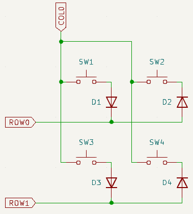 | 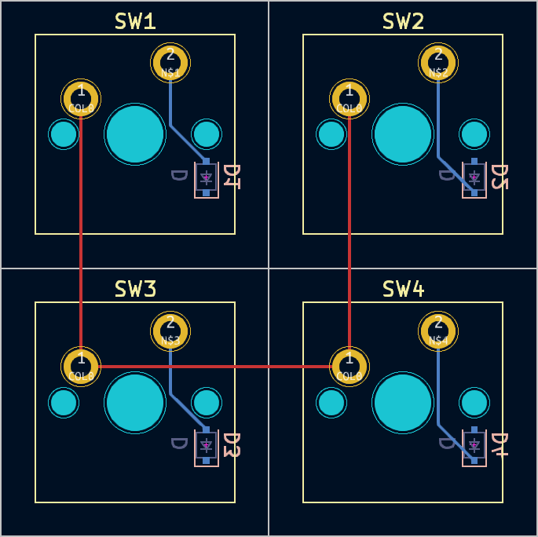 | 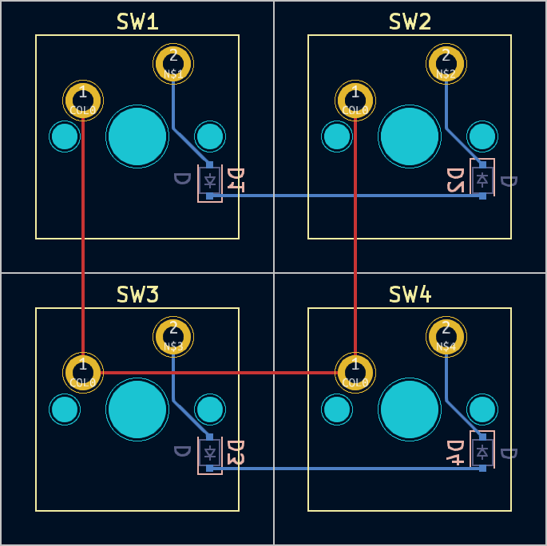

<!-- TOC --><a name="track-templating"></a>
### Track templating

If first switch-diode pair is routed before plugin execution, as shown below, `kicad-kbplacer` instead of
using it's built in routing algorithm, will copy user's track. This allow to circumvent plugin's router
limitations. This is applicable only for `Relative` `Position` option or when diode placement disabled
(with `Allow autoplacement` unticked). The latter is suited mostly for routing boards generated with
`ergogen`. When using `Relative Position` and `Save to` path defined, tracks will be stored in template.
Then it can be re-used when using `Preset` `Position` option.

Before | After
--- | ---
 | 


> [!NOTE]
> Track templating is recommended for more complicated switch footprints, for example reversible kailh.
> When switch footprint has multiple pads with the same net name, automatic router would try to connect
> only the two closest pads between diode and switch.

Below [example](./examples/2x3-rotations-custom-diode-with-track-and-complex-footprint) shows more complicated custom diode position with track template pre-routed by the user.
Manual work needs to be done only for first switch-diode pair, plugin will replicate layout for the
remaining pairs:

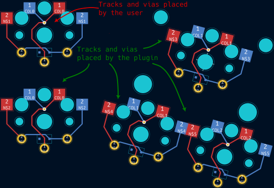

> [!WARNING]
> All footprints for diodes and switches **must** have same pad layouts, otherwise connection replication
> may yield unexpected results

<!-- TOC --><a name="additional-elements-placement"></a>
### Additional elements placement

In case additional elements need to be automatically placed next to corresponding switches (for example
stabilizer footprints if not integral part of switch footprint, or RGB LEDs), define entries
in `Additional elements settings` section. It behaves very similarly to switch diodes options with few exceptions:

- corresponding switch is matched based on annotation number and not net code
- there is no default position defined
- there is no track routing

<!-- TOC --><a name="building-board-outline"></a>
### Building board outline

The `kicad-kbplacer` plugin is capable of generating board edges around selected footprints
or all switches footprints (matched using `Switch Settings - Annotation Footprint` value).
It uses convex hull algorithm to calculate outline and allows to specify additional
increase/decrease amount by `Outline delta` value.

Outline delta 2.0mm | Outline delta -1.0mm
--- | ---
 | 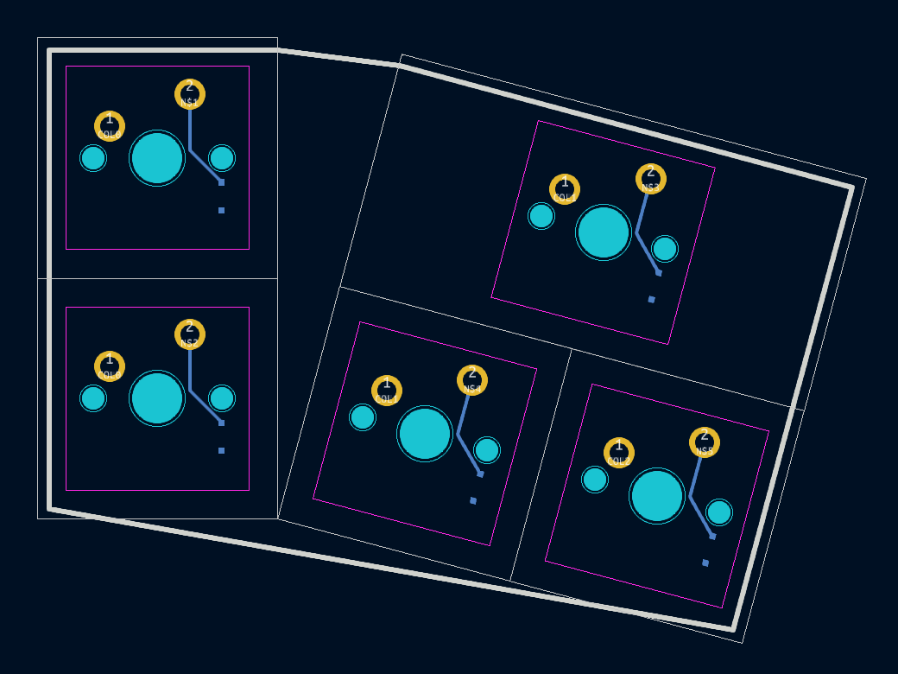

> [!IMPORTANT]
> To build outline using selected footprints, selection must be done before launching plugin
> and KiCad 7 or above must be used

<!-- TOC --><a name="run-without-layout"></a>
### Run without layout

Creating tracks, placing switch associated elements (like diodes) or building board outline
does not require layout file.
With empty `Keyboard layout file` field, switch placement is simply skipped.
Placing and routing of other elements will use already placed switches as reference points
and won't move them. This might be useful for PCB files generated by other tools,
for example [ergogen](https://github.com/ergogen/ergogen).

This works with custom diode positions and [track templating](#track-templating).

<!-- TOC --><a name="how-to-use-from-cli-or-another-tools"></a>
## Use from CLI or from another tools

<!-- TOC --><a name="run-as-a-script"></a>
### Run as a script

The `kbplacer` module might be executed as a script using python's `-m` command line option.

```shell
python -m kbplacer
```

This is command line equivalent of running this tool as KiCad plugin but without GUI interface.
Run it with `--help` option to get more details about options and CLI usage.

#### Layout format conversion script

The `kbplacer` is capable of converting layouts between various formats.
For example, to convert ergogen point file to KLE layout file:

```shell
python -m kbplacer.kle_serial \
  -in tests/data/ergogen-layouts/absolem-simple-points.yaml -inform ERGOGEN_INTERNAL \
  -out $(pwd)/absolem-kle.json -outform KLE_RAW
```

This command generates [this](./tests/data/ergogen-layouts/absolem-simple-reference.json) file
which can be loaded by keyboard-layout-editor website.

In case of VIA-like annotated layouts there is an option to perform 'collapse' operation.

```shell
python -m kbplacer.kle_serial \
  -in tests/data/via-layouts/wt60_d.json -inform KLE_VIA \
  -out $(pwd)/wt60_d-internal-collapsed.json -outform KLE_INTERNAL -collapse
```

<table>
    <tr>
        <td style="width:50%" align="center"><b>Before collapse</b></td>
        <td style="width:50%" align="center"><b>After collapse</b></td>
    </tr>
    <tr>
        <td>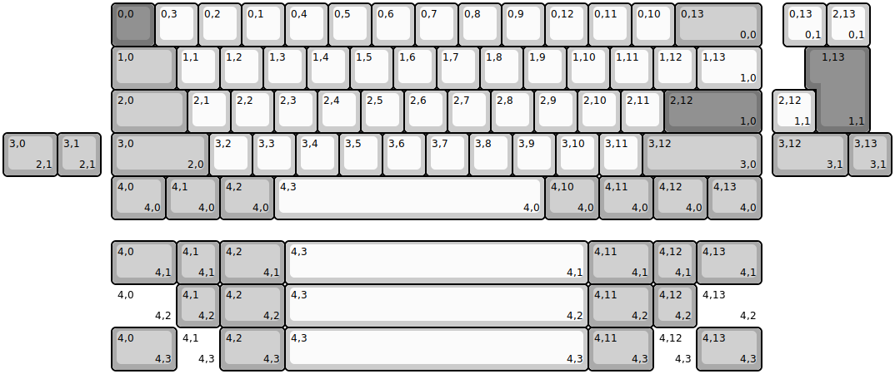</td>
        <td>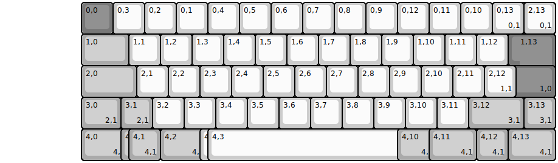</td>
    </tr>
</table>

Layout collapsing moves keys to theirs final physical position and removes
duplicates. Key is considered duplicate when there is another key of same
matrix position and size.

#### Extra tools

The `kbplacer` is used by additional tools available in [tools](tools/README.md) directory.

<table>
    <tr>
        <td style="width:33%" align="center"><b>Tool</b></td>
        <td align="center"><b>Example result</b></td>
    </tr>
    <tr>
        <td><code>layout2image.py</code> - generates KLE-like image for layout</td>
        <td></td>
    </tr>
    <tr>
        <td><code>layout2schematic.py</code> - generates KiCad schematic file with switch matrix</td>
        <td>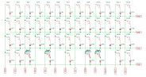</td>
    </tr>
    <tr>
        <td><code>layout2url.py</code> - small utility to generate KLE url</td>
        <td>
            To open new firefox tab with layout using <a href="http://www.keyboard-layout-editor.com/">keyboard-layout-editor</a> run</br>
            <code>python layout2url.py -in kle.json | xargs firefox</code></br>
            Example result: <a href="http://www.keyboard-layout-editor.com/##@@_a:7%3B&=&=%3B&@=&=">url</a>
        </td>
    </tr>
    <tr>
        <td>
            <code>layout2openscad.py</code> - generate plate for <a href="https://openscad.org/">openscad</a></br>
            (⚠️ experimental)
        </td>
        <td>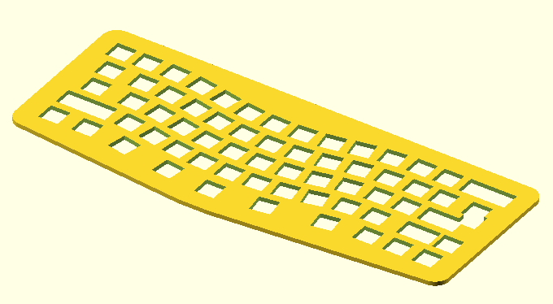</td>
    </tr>
</table>

<!-- TOC --><a name="use-in-python-projects"></a>
### Use in python projects

Some `kbplacer` functionality might be reused in another projects.
For example, to parse raw KLE data to it's internal form run:

``` python
from kbplacer.kle_serial import parse_kle
keyboard = parse_kle([["", ""]])
print(f"This keyboard has only {len(keyboard.keys)} keys")
```

The `kbplacer` API is used in following projects:

- [keyboard-pcbs](https://adamws.github.io/keyboard-pcbs/) ([repository](https://github.com/adamws/keyboard-pcbs)) -
benchmark for `kbplacer` - website with collection of pre-generated KiCad projects (both
schematics and PCB files) based on [via](https://github.com/the-via/keyboards) layouts.
Combines usage of `kbplacer` KiCad plugin and accompanying [tools](tools/README.md).
- [keyboard-tools](https://keyboard-tools.xyz/) ([repository](https://github.com/adamws/keyboard-tools)) -
website for generating PCB files from user uploaded layout files, combines `kbplacer` plugin
with [skidl](https://devbisme.github.io/skidl/) and aims to introduce no-schematic workflows
or provide decent starting point for traditional KiCad projects.

Creating keyboard PCB file from scratch (without skidl or using schematic generated with
`layout2schematic` tool) is also possible using `kbplacer` CLI interface although it is
currently considered experimental.

<!-- TOC --><a name="demo-keyboard-project"></a>
## Demo keyboard project

For example keyboard project see `demo` directory. This project contains 4x4 switch matrix with
layout json files in raw (`kle.json`) and internal (`kle_internal.json`) formats.
It requires [keyswitch-kicad-library](https://github.com/perigoso/keyswitch-kicad-library) to be installed.
Use this project to validate plugin installation.

<!-- TOC --><a name="troubleshooting"></a>
## Troubleshooting

<!-- TOC --><a name="plugin-does-not-load"></a>
### Plugin does not load

If plugin does not appear on the `Tools -> External Plugins` menu and its icon is missing on toolbar,
launch python scripting console `Tools -> Scripting Console` and type:

```
import pcbnew; pcbnew.GetWizardsBackTrace()
```

This should return backtrace with an information about the fault. Include this information in bug report.

<!-- TOC --><a name="plugin-misbehaves-or-crashes"></a>
### Plugin misbehaves or crashes

- Read stacktrace in error pop-up
- See `kbplacer.log` file, created in PCB directory

For bug reports please use [this template](https://github.com/adamws/kicad-kbplacer/issues/new?template=bug_report.md).

