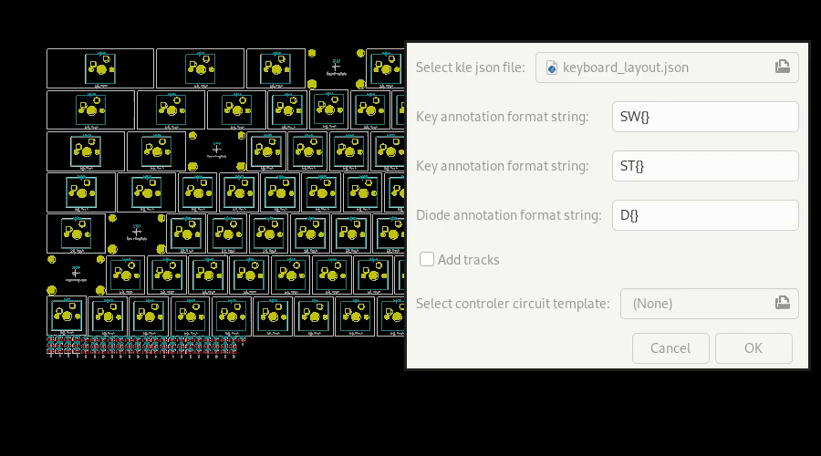

## kicad-kbplacer
KiCad plugin for mechanical keyboard design. It features automatic key placement based on popular layout description from [keyboard-layout-editor](http://www.keyboard-layout-editor.com/) 

## Motivation
All PCB's for mechanical keyboards shares common properties which creates great opportunity for scripting. Although this project does not aim to provide complete automatic PCB generation tool it speeds up development process by reducing tidiuos element placement task.

## Features
- [x] Automatic keys and diodes placement
- [x] Support for different annotation schemes
- [x] Basic track routing
- [ ] Key rotation support (experimental) 
- [ ] Footprint replacement
- [ ] User selectable diode position in relation to key position

## Instalation
- Clone this repository
- Copy `keyautoplace.py` (or create symbolic link) to one of the KiCad's plugin search locations. For details see [kicad documentation](https://docs.kicad-pcb.org/doxygen/md_Documentation_development_pcbnew-plugins.html) 
- Open KiCad's Pcbnew, run `Tools->External Plugins...->Refresh Plugins`. KeyAutoPlace plugin should appear in plugin list.

## How to use?
- Create new PCB and load netlist
- Obtain [kle-serial](https://github.com/ijprest/kle-serial) compatible layout json file (note: this is not json which can be downloaded directly from [keyboard-layout-editor](http://www.keyboard-layout-editor.com/) website. Guide is in preparation)
- Run KeyAutoPlace plugin
- Select desired json file and click OK.

## Troubleshooting
- See stacktrace
- See created `keyautoplace.log` file (in PCB directory)

