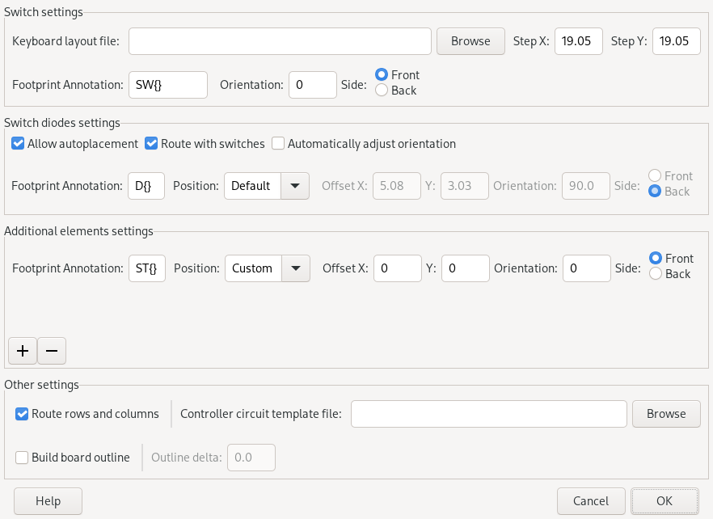

#  kicad-kbplacer

[](https://gitlab.com/kicad/addons/metadata/-/tree/main/packages/com.github.adamws.kicad-kbplacer)

[](https://circleci.com/gh/adamws/kicad-kbplacer/tree/master)
[](https://pypi.org/project/kbplacer/)
[](https://coveralls.io/github/adamws/kicad-kbplacer?branch=master)
[](https://hosted.weblate.org/engage/kicad-kbplacer/)

KiCad plugin for mechanical keyboard design. It features automatic key placement
based on popular layout descriptions from [keyboard-layout-editor](http://www.keyboard-layout-editor.com/)
and [ergogen](https://github.com/ergogen/ergogen).

## Motivation

All PCB's for mechanical keyboards shares common properties which creates great
opportunity for scripting. Although this project does not aim to provide
complete automatic PCB generation tool it speeds up development process
by reducing tedious element placement and routing tasks.

## Features

- [x] Automatic keys and diodes placement
- [x] Key rotation support
- [x] Basic track routing
- [x] User selectable diode position in relation to key position
- [x] Configurable additional elements placement

> [!WARNING]
> Ergogen support is new experimental feature and it has not been tested extensively


Some examples can be found in [examples](./examples) directory.

## Installation

To install release version of this plugin, use KiCad's `Plugin and Content Manager`
and select `Keyboard footprints placer` from official plugin repository.


To install development version, see how to use [custom plugin repository](./docs/custom_repository.md).
Custom repository is automatically updated with latest `master` branch builds
and it is available [here](https://adamws.github.io/kicad-kbplacer).

For development activities, it is recommended to checkout this repository and copy (or link)
content of `kbplacer` directory to one of the KiCad's plugin search paths.
For more details see [this](https://dev-docs.kicad.org/en/python/pcbnew/) guide.

After installation, plugin can be started by clicking plugin icon on the toolbar:


or selecting it from `Tools -> External Plugins` menu.

## How to use?

### Direct usage

- Create switch matrix schematic which meets following requirements:
  - Each switch has dedicated diode with same annotation number
  - Symbols are ordered by Y position
  - Diodes are column-to-row configuration (COL = Anode, ROW = Cathode)

  

  > [!NOTE]
  > Other matrix configurations are also supported. Track router will attempt
  > to connect closest (to each other) pads of switch and diode as long as both
  > have same `netname`, i.e. are connected on the schematic

- Create new PCB and load netlist
- Obtain json layout file from [keyboard-layout-editor](http://www.keyboard-layout-editor.com/) or
  convert [ergogen](https://github.com/ergogen/ergogen) points file to json

  <details>
  <summary>keyboard-layout-editor details</summary>

    

    Plugin supports internal [kle-serial](https://github.com/ijprest/kle-serial) layout files
    and [via](https://www.caniusevia.com/docs/layouts) files.
    Detection of layout format will be done automatically.
    Conversion between layout downloaded from keyboard-layout-editor and its internal form
    can be done with [https://adamws.github.io/kle-serial](https://adamws.github.io/kle-serial/)
    or [keyboard-tools.xyz/kle-converter](http://keyboard-tools.xyz/kle-converter)

    > [!NOTE]
    > When using `via` layouts, switch matrix **must** be annotated according to `via` rules.
    > If layout supports [multiple layout of keys](https://www.caniusevia.com/docs/layouts#layout-options)
    > only the default one will be used by `kicad-kbplacer`.

  </details>

  <details>
  <summary>ergogen details</summary>

    - open your design in https://ergogen.cache.works/ and download `points.yaml`

      

    - convert `yaml` to `json` (this operation is not integrated with `kicad-kbplacer` source
      because it would require installation of third-party `pyyaml` package and there is no
      good way to manage plugin dependencies yet)
      - you can use online converter, for example https://jsonformatter.org/yaml-to-json
    - converted file should be automatically recognized in next steps

  </details>

- Run `kicad-kbplacer` plugin
- Select json layout file and plugin options and click OK.

  

It is also possible to run this plugin from command line. Execute
following command (in the directory where plugin is installed) to get more details:

```
python -m com_github_adamws_kicad-kbplacer cli --help
```

> [!IMPORTANT]
> On windows, use python bundled with KiCad

#### Diode placement and routing

By default diodes are placed like shown below. This placement may not work for all switch and diode
footprints combinations.

Before | After
--- | ---
 | 

To use custom diode position there are two available options. Either select `Custom` in `Position` dropdown
and define `X/Y offset`, `Orientation` and `Front` or `Back` side:

  

or manually place `D1` diode to desired position in relation to first switch and run plugin with
`Current relative` `Position` option selected.

  

Remaining switch-diode pairs will be placed same as the first one.

Before | After
--- | ---
 | 

Some custom diodes positions may be to difficult for router algorithm.
In the above example it managed to connect diodes to switches but failed to connect diodes together.

Switch-to-diode routing is not done with proper auto-routing algorithm and it is very limited.
It attempts to create track in the shortest way (using 45&deg; angles) and doesn't look for other options
if there is a collision, leaving elements unconnected.

If first switch-diode pair is routed before plugin execution, as shown below, `kicad-kbplacer` instead of
using it's built in routing algorithm, will copy user's track. This allow to circumvent plugin's router
limitations. This is applicable only for `Current relative` `Position` option.

Before | After
--- | ---
 | 

#### Additional elements placement

In case additional elements need to be automatically placed next to corresponding switches (for example
stabilizer footprints if not integral part of switch footprint, or RGB LEDs), define entries
in `Additional elements settings` section. It behaves very similarly to switch diodes options with few exceptions:

- there is no default position defined
- when footprint not found, algorithm proceeds. There is no 1-to-1 mapping required
- there is no track routing

#### Demo project

For example demo project see `demo` directory. This project contains 4x4 switch matrix with
layout json files in raw (`kle.json`) and internal (`kle_internal.json`) formats.
It requires [keyswitch-kicad-library](https://github.com/perigoso/keyswitch-kicad-library) to be installed.
Use this project to validate plugin installation.

### As python package

For advanced users who want to integrate `kbplacer` with other tools or automate it's usage
there is a [pypi package](https://pypi.org/project/kbplacer/).
For example, it may be used for parsing raw KLE data to it's internal form:

``` python
from kbplacer.kle_serial import parse_kle
keyboard = parse_kle([["", ""]])
print(f"This keyboard has only {len(keyboard.keys)} keys")
```

Another example can be found in [tools/viaimages.py](./tools/viaimages.py) file.
This simple script creates images based on [`via`](https://www.caniusevia.com/docs/layouts) annotated layouts.
For more complex usage, see [keyboard-pcbs](https://github.com/adamws/keyboard-pcbs/blob/master/via_layouts_to_boards.py) repository. It demonstrates how to create `.kicad_pcb` file with switch matrix from scratch.

### As a service

This plugin is part of my another project. See [keyboard-tools](https://github.com/adamws/keyboard-tools) for more details.

## Troubleshooting

### Plugin does not load

If plugin does not appear on the `Tools -> External Plugins` menu and its icon is missing on toolbar,
launch python scripting console `Tools -> Scripting Console` and type:

```
import pcbnew; pcbnew.GetWizardsBackTrace()
```

This should return backtrace with an information about the fault. Include this information in bug report.

### Plugin misbehaves or crashes

- Read stacktrace in error pop-up
- See `kbplacer.log` file, created in PCB directory

For bug reports please use [this template](https://github.com/adamws/kicad-kbplacer/issues/new?template=bug_report.md).

