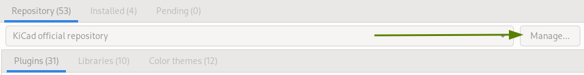
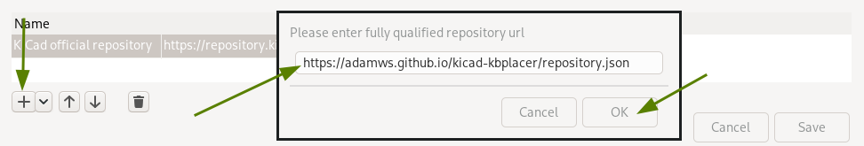
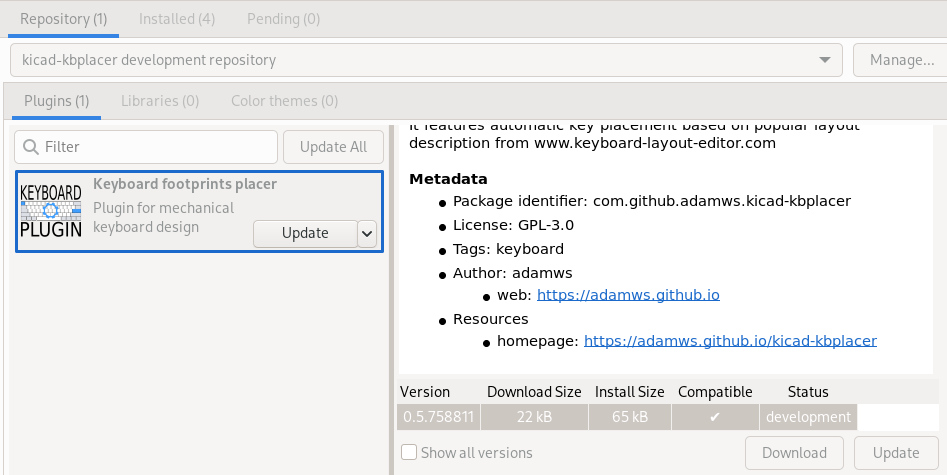

# Using custom plugin repository

It is possible to access latest `master` builds using development plugin repository.
Open KiCad's plugin manager and add `https://adamws.github.io/kicad-kbplacer/repository.json`
to repository list.

This will allow to install `development` version of plugin which updates after each commit to main branch.

