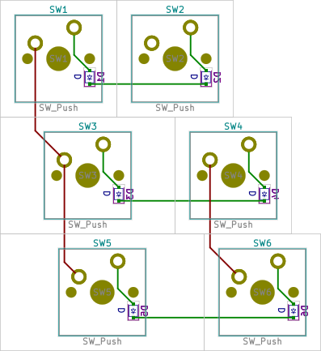

# Examples

Each example has own directory with following file structure:

- `{example name}-kle.json` - keyboard's layout downloaded from [keyboard-layout-editor](http://www.keyboard-layout-editor.com).
- `{example name}-kle-internal.json` - keyboard's layout after processing with [kle-serial](https://github.com/ijprest/kle-serial).
  This file is expected by `keyautoplace` plugin.
- `{example name}.net` - example's netlist.
- `{example name}-before.kicad_pcb` - PCB file with loaded netlist and parts placed
  at default location (by KiCad's netlist loader). This file is useful for manual
  testing of plugin's code changes.
- `{example name}-after.kicad_pcb` - PCB file after running plugin. Demonstrates
  current capabilities - this file does not contain any manual changes.
- `fp-lib-table` - footprints location file, points to external dependencies
  stored in parent's `libs` directory.
- `pictures/keyboard-layout.png` - picture of keyboard-layout-editor layout.
- `pictures/{example name}-after-brd.png` - picture of PCB, this file is created
  by converting KiCad's SVG export.

## Examples summary

Name | Keyboard layout | PCB result
--- | --- | ---
2x2 |  | 
3x2-sizes |  |  Note that in this example `SW2` belongs to column 1 and `SW4&SW6` to column 2.
