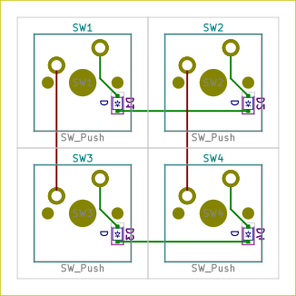
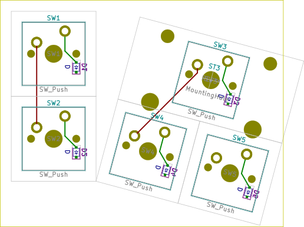

# Examples

Each example has own directory with following file structure:

- `kle.json` - keyboard's layout downloaded from [keyboard-layout-editor](http://www.keyboard-layout-editor.com).
- `kle-internal.json` - keyboard's layout after processing with [kle-serial](https://github.com/ijprest/kle-serial).
  This file is expected by `keyautoplace` plugin.
- `keyboard.net` - example's netlist.
- `keyboard-before.kicad_pcb` - PCB file with loaded netlist and parts placed
  at default location (by KiCad's netlist loader). This file is useful for manual
  testing of plugin's code changes.
- `keyboard-after.kicad_pcb` - PCB file after running plugin. Demonstrates
  current capabilities - this file does not contain any manual changes.
- `fp-lib-table` - footprints location file, points to external dependencies
  stored in parent's `libs` directory.
- `pictures/keyboard-layout.png` - picture of keyboard-layout-editor layout.
- `pictures/keyboard-after-brd.png` - picture of PCB, this file is created
  by converting KiCad's SVG export.

## Examples summary

Name | Keyboard layout | PCB result
--- | --- | ---
2x2 (ok) |  | 
3x2-sizes (ok) |  |  Note that in this example `SW2` belongs to column 1 and `SW4&SW6` to column 2.
1x4-rotations-90-step (not ok) |  |  Diodes are not connected together.
2x3-rotations (not ok) |  |  Although `COL1` trace do not colide with drill holes, distance is to small to pass DRC checks. Diodes are not connected together. Routing support for rotations is incomplete. Parts placement is ok.
