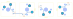
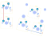
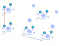
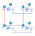

# Examples

Each example has own directory with following file structure:

- `kle.json` - keyboard's layout downloaded from [keyboard-layout-editor](http://www.keyboard-layout-editor.com).
- `kle-internal.json` - keyboard's layout after processing with [kle-serial](https://github.com/ijprest/kle-serial).
  This file is expected by `kbplacer` plugin.
- `keyboard.net` - example's netlist.
- `keyboard-before.kicad_pcb` - PCB file with loaded netlist and parts placed
  at default location (by KiCad's netlist loader). This file is useful for manual
  testing of plugin's code changes.
- `keyboard-after.kicad_pcb` - PCB file after running plugin. Demonstrates
  current capabilities - this file does not contain any manual changes.
- `fp-lib-table` - footprints location file, points to external footprints
  stored in parent's `examples.pretty` directory.
- `keyboard-layout.png` - picture of keyboard-layout-editor layout.
- `render.svg` - picture of PCB, this file is created by KiCad's SVG export.

## Examples summary

| Name                                                                         | Keyboard layout                                                                                                                                          | PCB result                                                                                                                                                                                                                                                                                                                                       |
| ---                                                                          | ---                                                                                                                                                      | ---                                                                                                                                                                                                                                                                                                                                              |
| 2x2                                                                          |                                                                                                                  |                                                                                                                                                                                                                                                                                                                    |
| 3x2-sizes                                                                    |                                                                                                      |  Note that in this example `SW2` belongs to column 1 and `SW4&SW6` to column 2.                                                                                                                                                                                                                        |
| 1x4-rotations-90-step                                                        |                                                                              |  Not all diodes are connected together.                                                                                                                                                                                                                                        |
| 2x3-rotations                                                                |                                                                                              |  Diodes `D4` and `D5` are connected because they use same rotation. Elements with different rotation, like `D3` and `D4` are not routed. Placement is ok but some traces need to be added manually.                                                                                            |
| 2x3-rotations with custom diode                                              |                                              |  Same as previous example but with custom diode location and pre-routed track. This custom diode position would not work with automatic switch-diode routing algorithm implemented by the plugin.                                              |
| 2x3-rotations with custom diode and reversible hot swappable kailh footprint |  |  Same as previous example but with custom diode location and pre-routed tracks. Note that this footprint has multiple pads of the same nets. Track template from `SW1` was copied for all of them. |
| 2x3-rotations with two diodes per switch                                     |                                                                         |  Same as `2x3-rotations` example but with two diodes with pre-routed tracks per switch. Note that diodes annotation number does not match switch numbers. Diodes are associated with switches based on netlist.                                                    |
| 2x2 with alternative layout                                                  |                                                                         |  Same as `2x2` example but alternative bottom row `SW3a` key.                                                                                                                                                                                                      |
| 2x2 japanese duplex matrix                                                   |                                                                    |  Same as `2x2` example but with single column and `D2`/`D4` diodes rotated (with `Automatically adjust orientation` option enabled.                                                                                                                           |
