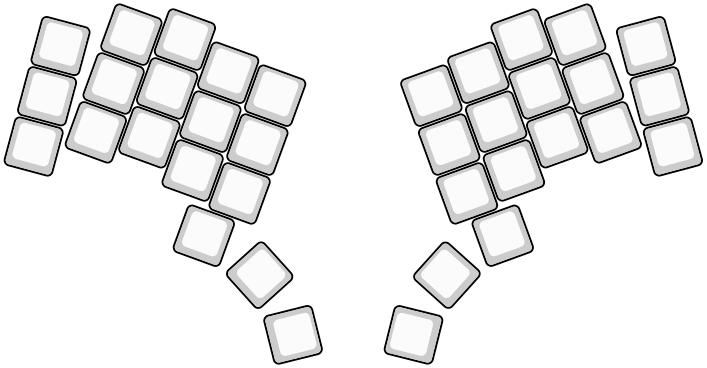

# Tools

- `layout2image.py` - generate KLE style SVG image from keyboard layout
- `layout2schematic.py` - generate KiCad schematic file from keyboard layout
- `layout2url.py` - generate KLE url
- `layout2openscad.py` - generate plate for [openscad](https://openscad.org/) (:warning: experimental)

## How to run

The `kbplacer` project uses `pyprojet.toml` with [`hatch`](https://hatch.pypa.io) project manager.
It defines `tools` environment with required dependencies and scripts.
To execute, run:

```shell
$ hatch run tools:layout2image {args...}
$ hatch run tools:layout2schematic {args...}
$ hatch run tools:layout2url {args...}
$ hatch run tools:layout2openscad {args...}
```

Alternatively, install required dependencies and run as regular python script:

```shell
python tools/layout2image.py {args...}
python tools/layout2schematic.py {args...}
python tools/layout2url.py {args...}
python tools/layout2openscad.py {args...}
```

## Examples

To generate schematic file and schematic image based on layout file:

```shell
hatch run tools:layout2schematic --in examples/2x2/via.json --out 2x2.kicad_sch
kicad-cli sch export svg -e 2x2.kicad_sch
```


(cropped for readability)

To generate layout image based on layout file:

```shell
hatch run tools:layout2image --in tests/data/ergogen-layouts/absolem-simple-points.yaml \
  --out absolem.svg
```



As you can see, there are slight rotation issues on this generated image.
This is the problem with SVG generation code because layout imported to KLE looks ok:


To generate KLE url for run:

```shell
hatch run tools:layout2url --in tests/data/ergogen-layouts/absolem-simple-points.yaml
```

This will produce following
[link](http://www.keyboard-layout-editor.com/##@@_r:15&rx:0.473684&ry:2.625528&y:-0.473684&x:-0.473684&a:7&w:0.947368&h:0.947368%3B&=%3B&@_rx:0.732503&ry:1.659602&y:-0.473684&x:-0.473684&w:0.947368&h:0.947368%3B&=%3B&@_rx:0.991322&ry:0.693676&y:-0.473684&x:-0.473684&w:0.947368&h:0.947368%3B&=%3B&@_r:20&rx:1.669707&ry:2.353069&y:-0.473684&x:-0.473684&w:0.947368&h:0.947368%3B&=%3B&@_rx:2.011728&ry:1.413377&y:-0.473684&x:-0.473684&w:0.947368&h:0.947368%3B&=%3B&@_rx:2.353748&ry:0.473684&y:-0.473684&x:-0.473684&w:0.947368&h:0.947368%3B&=%3B&@_rx:2.699405&ry:2.447802&y:-0.473684&x:-0.473684&w:0.947368&h:0.947368%3B&=%3B&@_rx:3.041426&ry:1.508109&y:-0.473684&x:-0.473684&w:0.947368&h:0.947368%3B&=%3B&@_rx:3.383446&ry:0.568417&y:-0.473684&x:-0.473684&w:0.947368&h:0.947368%3B&=%3B&@_rx:3.531092&ry:3.086567&y:-0.473684&x:-0.473684&w:0.947368&h:0.947368%3B&=%3B&@_rx:3.746559&ry:4.341188&y:-0.473684&x:-0.473684&w:0.947368&h:0.947368%3B&=%3B&@_rx:3.873112&ry:2.146875&y:-0.473684&x:-0.473684&w:0.947368&h:0.947368%3B&=%3B&@_rx:4.215132&ry:1.207182&y:-0.473684&x:-0.473684&w:0.947368&h:0.947368%3B&=%3B&@_rx:4.434782&ry:3.527502&y:-0.473684&x:-0.473684&w:0.947368&h:0.947368%3B&=%3B&@_rx:4.776802&ry:2.58781&y:-0.473684&x:-0.47368400000000044&w:0.947368&h:0.947368%3B&=%3B&@_rx:5.118822&ry:1.648117&y:-0.473684&x:-0.47368400000000044&w:0.947368&h:0.947368%3B&=%3B&@_r:48&rx:4.820217&ry:5.099935&y:-0.47368400000000044&x:-0.47368399999999955&w:0.947368&h:0.947368%3B&=%3B&@_r:76&rx:5.46258&ry:6.247021&y:-0.47368400000000044&x:-0.47368399999999955&w:0.947368&h:0.947368%3B&=%3B&@_r:-76&rx:7.778899&y:-0.47368400000000044&x:-0.47368399999999955&w:0.947368&h:0.947368%3B&=%3B&@_r:-48&rx:8.421262&ry:5.099935&y:-0.47368400000000044&x:-0.47368400000000044&w:0.947368&h:0.947368%3B&=%3B&@_r:-20&rx:8.122657&ry:1.648117&y:-0.473684&x:-0.47368400000000044&w:0.947368&h:0.947368%3B&=%3B&@_rx:8.464677&ry:2.58781&y:-0.473684&x:-0.47368400000000044&w:0.947368&h:0.947368%3B&=%3B&@_rx:8.806697&ry:3.527502&y:-0.473684&x:-0.47368400000000044&w:0.947368&h:0.947368%3B&=%3B&@_rx:9.026347&ry:1.207182&y:-0.473684&x:-0.47368400000000044&w:0.947368&h:0.947368%3B&=%3B&@_rx:9.368367&ry:2.146875&y:-0.473684&x:-0.47368400000000044&w:0.947368&h:0.947368%3B&=%3B&@_rx:9.49492&ry:4.341188&y:-0.473684&x:-0.47368400000000044&w:0.947368&h:0.947368%3B&=%3B&@_rx:9.710387&ry:3.086567&y:-0.473684&x:-0.47368400000000044&w:0.947368&h:0.947368%3B&=%3B&@_rx:9.858033&ry:0.568417&y:-0.473684&x:-0.47368400000000044&w:0.947368&h:0.947368%3B&=%3B&@_rx:10.200054&ry:1.508109&y:-0.473684&x:-0.47368400000000044&w:0.947368&h:0.947368%3B&=%3B&@_rx:10.542074&ry:2.447802&y:-0.473684&x:-0.47368400000000044&w:0.947368&h:0.947368%3B&=%3B&@_rx:10.887731&ry:0.473684&y:-0.473684&x:-0.47368400000000044&w:0.947368&h:0.947368%3B&=%3B&@_rx:11.229751&ry:1.413377&y:-0.473684&x:-0.47368400000000044&w:0.947368&h:0.947368%3B&=%3B&@_rx:11.571772&ry:2.353069&y:-0.473684&x:-0.47368400000000044&w:0.947368&h:0.947368%3B&=%3B&@_r:-15&rx:12.250157&ry:0.693676&y:-0.473684&x:-0.47368400000000044&w:0.947368&h:0.947368%3B&=%3B&@_rx:12.508976&ry:1.659602&y:-0.473684&x:-0.47368400000000044&w:0.947368&h:0.947368%3B&=%3B&@_rx:12.767795&ry:2.625528&y:-0.473684&x:-0.47368400000000044&w:0.947368&h:0.947368%3B&=).

To convert `ergogen` layouts to KLE see [layout and format conversion script](../README.md#layout-format-conversion-script)
