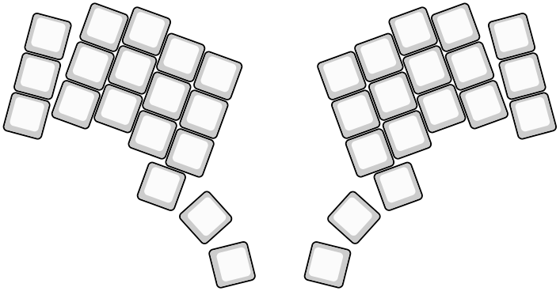

# Tools

- `layout2image.py` - generate KLE style SVG image from keyboard layout
- `layout2openscad.py` - generate plate for [openscad](https://openscad.org/) (:warning: experimental)

## How to run

The `kbplacer` project uses `pyprojet.toml` with [`hatch`](https://hatch.pypa.io) project manager.
It defines `tools` environment with required dependencies and scripts.
To execute, run:

```shell
$ hatch run tools:layout2image {args...}
$ hatch run tools:layout2openscad {args...}
```

Alternatively, install required dependencies and run as regular python script:

```shell
python tools/layout2image.py {args...}
python tools/layout2openscad.py {args...}
```

## Examples

To generate layout image based on layout file:

```shell
hatch run tools:layout2image --in tests/data/ergogen-layouts/absolem-simple-points.yaml \
  --out absolem.svg
```



To convert `ergogen` layouts to KLE see [layout and format conversion script](../README.md#layout-format-conversion-script)

> [!WARNING]
> Tools are not yet part of `kbplacer` package and are tested mostly by-hand.
> To execute limited tests we have run `hatch run tools:test`.
